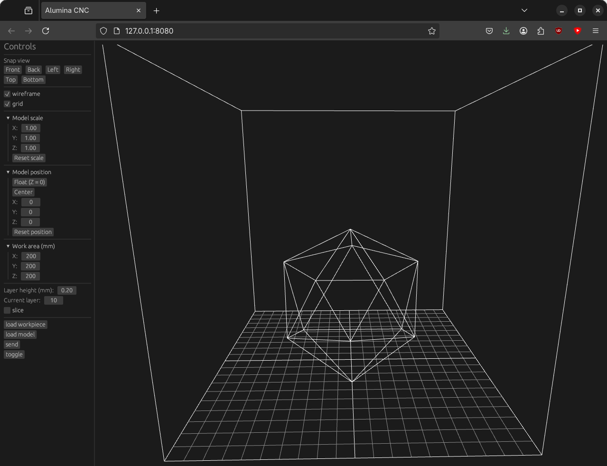

# Alumina UI

Alumina is an integrated CAD/CAM, physics simulation, and motion control solution written entirely in Rust.  It is intended to control laser and plasma cutters, 3D printers, CNC routers and mills, and lathes.  There are two parts to Alumina: the [firmware](https://github.com/timschmidt/alumina-firmware) which targets the esp32c3 microcontroller, sets up a Wifi AP called "Alumina", serves the Alumina UI via HTTP, responds to commands from the Alumina UI via HTTP, and performs motion planning and step generation.  The [UI](https://github.com/timschmidt/alumina-ui) targets [WebAssembly](https://en.wikipedia.org/wiki/WebAssembly), draws geometry using WebGLand egui, and manipulates geometry using [csgrs](https://github.com/timschmidt/csgrs).  Both parts fit in the onboard flash of the esp32c3.



## Community
[](https://discord.gg/9WkD3WFxMC)

## Development
### Set up toolchain
```shell
cargo install trunk wasm-opt wasm-tools
```

### Run locally
```shell
trunk serve --open --release
```

## Todo
- implement picking for lines and vertices
- https://github.com/JeroenGar/jagua-rs for bin packing
- generate toolpaths from slices
- send toolpaths to firmware
- implement SD card support
- create oscope 2D plot on Diagnostic tab
- update to eframe v0.29
- integrate [egui_node_graph2](https://github.com/philpax/egui_node_graph2) with Design tab
